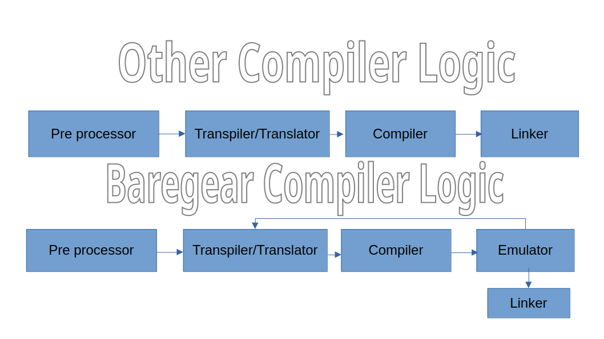

Applying Macro
==============

Frontend/Backend Logic:

Macro Is Needed For Creating The Application For Cross Platform,
For Example Windows Code Not Work On MacOS Or Linux, And If You
Use Macro To Keep Your Code As Customizable And Cross Platform.
And Make To Easier To Modify The Value Of Code.

.. code-block:: baregear

    osName:
    #ifdef defined WINDOWS
        print "Windows"
    #else if defined MAC_OS
        print "MacOS"
    #elif defined Linux
        print "Linux"
    #else
        print "Unknown"
    #end

    osName

The Preprocessor Preprocess Your Code:

Windows Target:

.. code-block:: baregear

    osName:
        print "Windows"

    osName

MacOS Target:

.. code-block:: baregear

    osName:
        print "MacOS"

    osName

Linux Target:

.. code-block:: baregear

    osName:
        print "Linux"

    osName

Unknown Platform Target:

.. code-block:: baregear

    osName:
        print "Unknown"

    osName

Defining A Macro Value:

.. code-block:: baregear

    #define EARTH_CREATION_DATE      "Earth Has Been Created 4 Billion Years Ago."

    print EARTH_CREATION_DATE

External Definition:

.. code-block:: bash

    $ baregear macro.br -o macro -dEARTH_CREATION_DATE="Earth Has Been Created 4 Billion Years Ago."

Notes:

- Preprocessor Always Replaces Macro Value Definition With Macro Value

After Preprocessing:

.. code-block:: baregear

    print "Earth Has Been Created 4 Billion Years Ago."

Enabling/Disabling Compiler Features:

.. code-block:: baregear

    #nofeature gc
    #feature uiToolkit

- `#feature` keyword used for enable feature
- `#nofeature` keyword used for disable feature

List Of Compiler Features:

1. `framework`: High-Level Framework
2. `UI`: High-Level UI Rendering Toolkit
3. `gc`: Garbage Collector
4. `mm`: High-level Memory Manager Note: Garbage Collector Disabled If Memory Manager Is Disabled

- Note: All Compiler Built-in features support the bare-metal implementation of code

Setting Importance Flag
-----------------------

Syntax:

.. code-block:: baregear
    #importance <importanceLevel>
        [code]

Importance Flag Is Used To Set Importance Of Function Execution And
It Helps To Find The Exact Location Of 'No Required Code Execution'
Bug For Example: If Code Is Not Executing In The Emulator
But That Code Is Flagged As Important To Compiler Throw The Error
Prints Like 'Code Not Executing But Flagged As Important.'.

.. code-block:: baregear

    WORKS = 0
    if WORKS == 1:
        #importance high
            print "Working"
    else:
        print "Not Working"

Error Prints Like:

.. code-block:: baregear

    importance.br:3:4
    WORKS = 0
    if WORKS = 1:
        #importance high
        ^
        Code Not Executing But Flagged As Important.

Importance Level:
`low`: The Code Must Be Executed Minimum 1 Times
`medium`:  The Code Must Be Executed Sometimes
`high`: The Code Must Be Executed Properly
`urgent`: The Code Must Be Executed Always